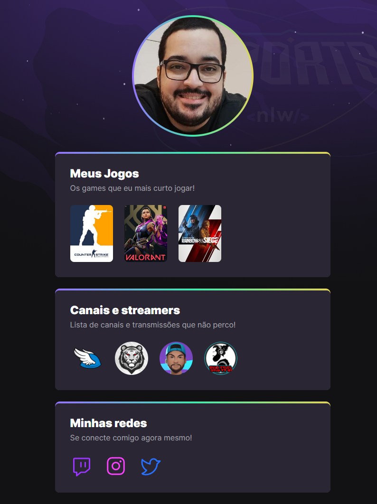

# 🕹️NLW eSports
    > Trilha Explorer

Projeto desenvolvido durante o evento NextLevelWeek da RocketSeat, durante a semana de 10 a 18 de setembro.
## 

🔗[Acesse aqui](https://nlw-esports-explorer.netlify.app/)

## 💻Tecnologias usadas

* Html
* Css
* Javascript

## 🎯Objetivo do projeto

Me inscrevi na trilha ignite do evento, mas consegui acompanhar a trilha explorer também e aproveitei para rever conceitos básicos e um projeto sem frameworks. Também aproveitei a trilha para praticar JavaScript e adicionar um pouco de dinamismo às listas.

## 📨 Entre em contato

